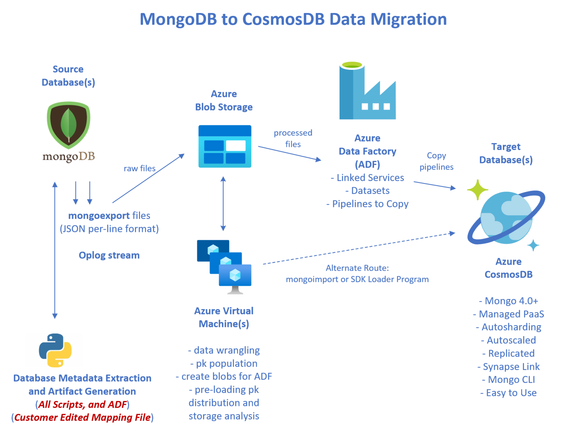

# azure-cosmos-db-mongo-migration

This repo: https://github.com/Azure-Samples/azure-cosmos-db-mongo-migration

## MongoDB to CosmosDB Migrations: Questions to Consider

### Migration Context?

- Reason(s) for the migration
  - Other goals beyond moving the data to another DB
- Source Database
- Target Database(s)
- Number of databases and collections/containers
- Amount of data
- Network bandwidth to Azure
- Batch vs Streaming
- Global Locations / Regions
- Timeframe
- Other Requirements / Constraints

### Database/Schema design?

- Is it a **verbatim** migration?
- Do you want to **optimize/refactor** the design?
- Do you want to **optimize for CosmosDB costs and Autoscaling**?
- Large documents over 2MB
- Sharding / Horizontal Partitioning / Partition Keys

### CosmosDB Target API?

- CosmosDB/Mongo 4.x
- CosmosDB/Core API  (aka - CosmosDB/SQL API)
- Other

#### CosmosDB Mongo API Feature Support

- https://docs.microsoft.com/en-us/azure/cosmos-db/mongodb/mongodb-introduction
- https://docs.microsoft.com/en-us/azure/cosmos-db/mongodb/feature-support-42
- https://docs.microsoft.com/en-us/azure/cosmos-db/mongodb/feature-support-40
- https://docs.microsoft.com/en-us/azure/cosmos-db/mongodb/feature-support-36
- https://docs.microsoft.com/en-us/azure/cosmos-db/mongodb/feature-support-32

### What are your preferred technologies?

- Linux/Bash/Python
- DotNet
- Azure Data Factory
- Other

### Who is involved in executing the migration?

- The Application Developers
- The DevOps team
- Third-party Vendor, Partner, or Systems Integrator
- Microsoft 

### Migration Solutions to Consider

- [mongoexport/mongoimport or mongodump/mongorestore](https://docs.microsoft.com/en-us/azure/cosmos-db/mongodb/tutorial-mongotools-cosmos-db)
- [Azure Data Factory](https://azure.microsoft.com/en-us/services/data-factory/)
- [Data Migration Service (DMS) - tutorial](https://docs.microsoft.com/en-us/azure/dms/tutorial-mongodb-cosmos-db)
- [Data Migration Service (DMS) - features](https://azure.microsoft.com/en-us/services/database-migration/#features) 
- [Data Migration Tool](https://docs.microsoft.com/en-us/azure/cosmos-db/import-data)
- [Pre-Migration Assessment](https://docs.microsoft.com/en-us/azure/cosmos-db/mongodb/pre-migration-steps#pre-migration-discovery)
- [Data Migration Assistant Notebook](https://github.com/AzureCosmosDB/Cosmos-DB-Migration-Assistant-for-API-for-MongoDB)
- **Also, this Code-based Migration Process in this repository**

---

<p align="center"></p>

## Code-based Migration Process Features

This project framework provides the following features:

- **MongoDB to CosmosDB Data Migration**
- **Optional Data Transformation**
- **Several migration approaches are supported** by this project, including:
  - mongoexport from source database is used in all cases
  - optional verbatim migrations
  - optional mongoexport document wrangling/transformation
  - optional target database schema/collection refactoring
  - optional analysis of mongoexport files for candidate CosmosDB partition-keys
  - load CosmosDB with mongoimport, a Dotnet client program, or Azure Data Factory (ADF)

- **The Process uses metadata-driven code generation to generate executable artifacts**
  - shell scripts
  - configuration files
  - Azure Data Factory JSON code files
- A **User-edited mapping file which maps source to target databases**
  - this mapping file can itself be generated
- The **intent is to have a highly automated migration process**
  - support migrating dozens/hundreds of databases, and thousands of collections
  - zero human edits of the generated code/artifacts are necessary

## Getting Started

[See the Documentation](docs/README.md) and clone this repository.

### Prerequisites

- git
- python 3
- mongo tooling - mongoexport, mongoimport, mongo shell
- Developer workstation of any OS (macOS, Windows, Linux)
- Azure CLI program, az
- Ubuntu Virtual Machine(s) in Azure to execute the majority of the process
- Docker for executing the Reference Application locally
- Your source-control system that is network-accessable to Azure VMs
- [See the docs on workstation setup](docs/03_development_computer_setup.md)

### Installation

Clone this GitHub repository to your Development workstation and/or VM
with network access to your current MongoDB database(s).

```
$ git clone https://github.com/Azure-Samples/azure-cosmos-db-mongo-migration.git
```

**Then copy this project to your Git or other source-control system.**

It is assumed that your source-control system (GitHub, Azure DevOps, etc)
has network access to Azure VMs.

### Quickstart

[See the Documentation, Summary of Actions and Scripts to Execute](docs/README.md)

## Demo

A [Reference Application](reference_app/readme.md) is included in this repository
to show how to use this migration process.

This reference application database can be deployed to either a Docker-containerized
MongoDB instance, or to your development MongoDB instance.

See [running MongoDB locally as a Docker container](reference_app/mongo_docker/readme.md).

## Resources

- [Azure Cosmos DB](https://azure.microsoft.com/en-us/services/cosmos-db/)
- [Azure Cosmos DB API for MongoDB](https://docs.microsoft.com/en-us/azure/cosmos-db/mongodb/mongodb-introduction)
- [mongoexport](https://docs.mongodb.com/database-tools/mongoexport/)
- [Azure Data Factory](https://docs.microsoft.com/en-us/azure/data-factory/)

---

## A Directory Map of this Repository

Directory **m2c/** contains the implementation of this migration process,
while directory **reference_app/** contains a working example of this process.

```
├── docs                             <-- project documentation in markdown format
│
├── m2c                              <-- The root Mongo-To-Cosmos (m2c) implementation directory
│   ├── az                           <-- az CLI scripts for Azure Resource Provisioning
│   │   └── uvm                      <-- files related to the Ubuntu Linux Azure VM used in this process
│   │       └── scripts              <-- setup scripts to execute on an Ubuntu Linux Azure VM
│   ├── dotnet_mongo_loader          <-- C# program to load the target Cosmos/Mongo database
│   ├── plots                        <-- png visualizations created by mongoexport_pk_analyze.py
│   ├── pysrc                        <-- python source files
│   ├── templates                    <-- Python Jinja2 templates for code generation
│
└── reference_app
    │
    ├── artifacts                    <-- the generated code artifacts in this directory and below
    │   ├── adf                      <-- the generated Azure Data Factory artifacts
    │   │   ├── dataset
    │   │   ├── linkedService
    │   │   └── pipeline
    │   └── shell                    <-- generated shell scripts to execute on a linux VM
    │       ├── data
    │       ├── dotnet_mongo_loader  <-- the DotNet loader program
    │       ├── mongo                <-- generated mongo scripts for CosmosDB target database
    │
    ├── data
    │   ├── metadata                 <-- metadata, mapping, and manifest files
    │   └── mongoexports             <-- the mongoexport files from the source database
    │       ├── olympics             <-- one subdirectory for each source database
    │       └── openflights
    │
    └── mongo_docker                 <-- this directory can run the Mongo Docker container
        ├── data_wrangling           <-- "private" directory for creating the loadable reference data
        ├── mongo                    <-- mongodb "ddl" scripts to create the reference databases
        ├── olympics                 <-- the data for the olympics reference database
        │   ├── import_json
        │   └── raw
        └── openflights              <-- the data for the openflights (travel) reference database
            ├── import_json
            └── raw
```