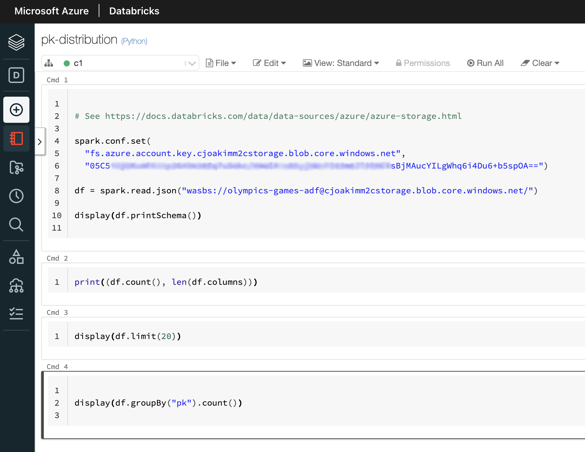
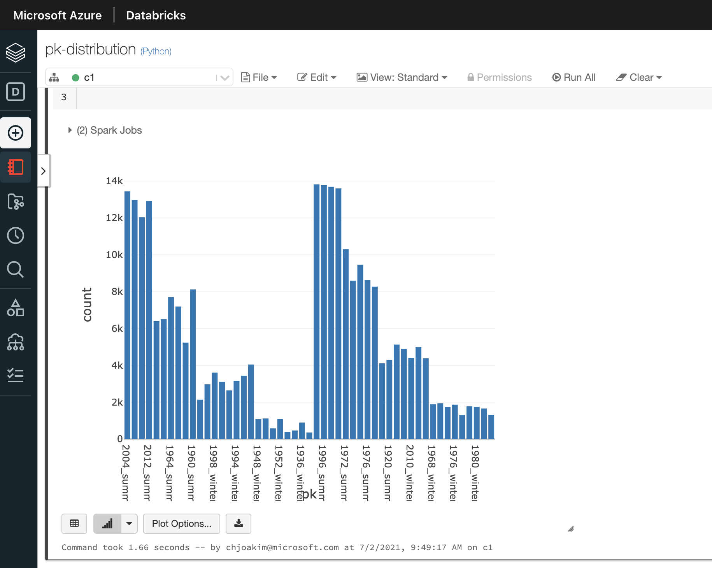

# 16 - Partition Key Distribution Analysis

Before you load your wrangled/transformed blob data into the target CosmosDB
you may wish to do some analysis of the data.

For example, you may want to understand the **partition key distribution** of your data.
You should ideally have a **high cardinality** and **well distributed** set of
**partition key values**.  You may be surprised by the results of this analysis,
and therefore refactor your partition key design before loading your target CosmosDB.

## PySpark Notebook Example Code

One way to do this analyis is with an Azure Spark environment - such as **Azure Synapse,
Azure Machine Learning, or Azure Databricks** as shown here.

This example shows a simple **PySpark Notebook** which reads the wrangled/transformed blob data destined for a target collection, groups the partition key values, and produces
a histogram visualization.  This visualization can be very useful in understanding your data. 

Note that this PySpark Notebook reads all of the JSON Blobs in the given olympics-games-adf
container in one DataFrame (i.e. - df) for analysis.  Likewise, the Azure Data Factory 
Pipeline would copy all of these blobs from this storage container into a target CosmosDB 
container.

<p align="center"></p>

---

<p align="center"></p>

---

## Notebook Example Code

The code from the above Notebook is shown here, for copy-and-paste purposes.
Each of the "# COMMAND" sections is a cell of the notebook.

```
# Databricks notebook source

# See https://docs.databricks.com/data/data-sources/azure/azure-storage.html

spark.conf.set(
  "fs.azure.account.key.cjoakimm2cstorage.blob.core.windows.net",
  "05C5...secret...==")

df = spark.read.json("wasbs://olympics-games-adf@cjoakimm2cstorage.blob.core.windows.net/")

display(df.printSchema())

# COMMAND ----------

print((df.count(), len(df.columns)))

# COMMAND ----------

display(df.limit(20))

# COMMAND ----------

display(df.groupBy("pk").count())
```
